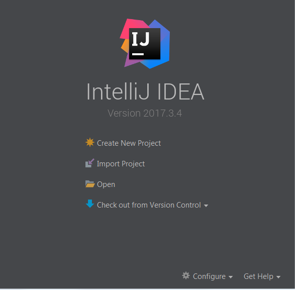
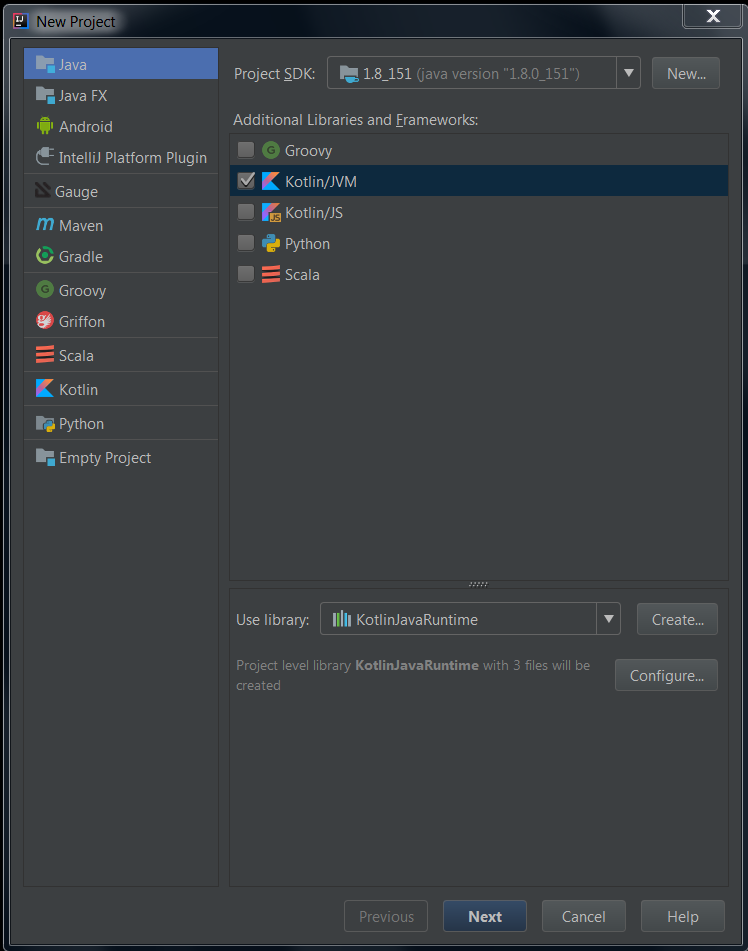
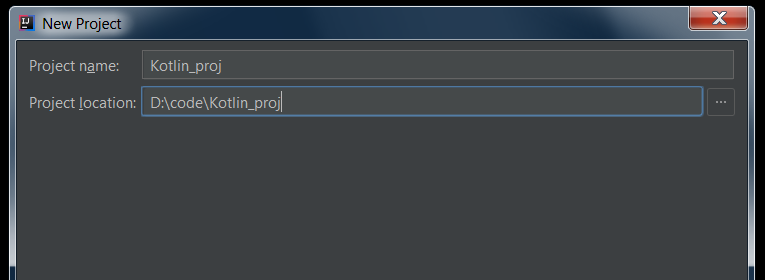
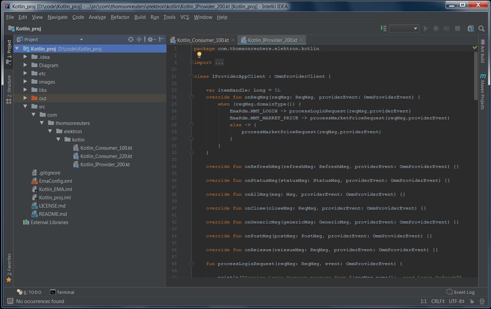
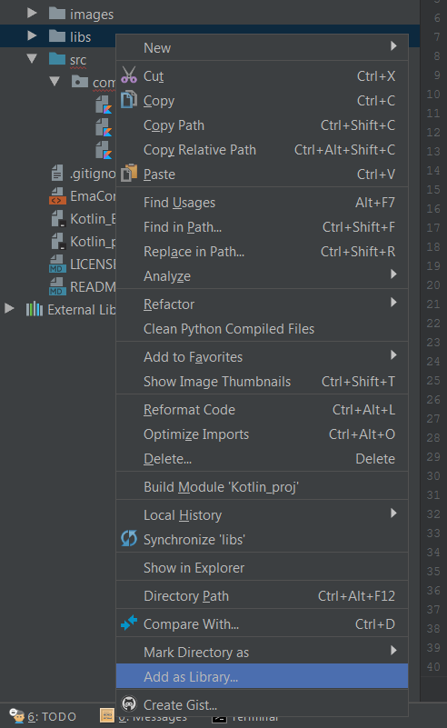
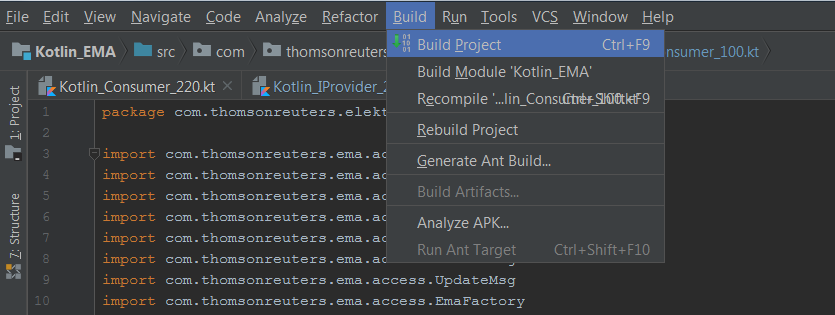
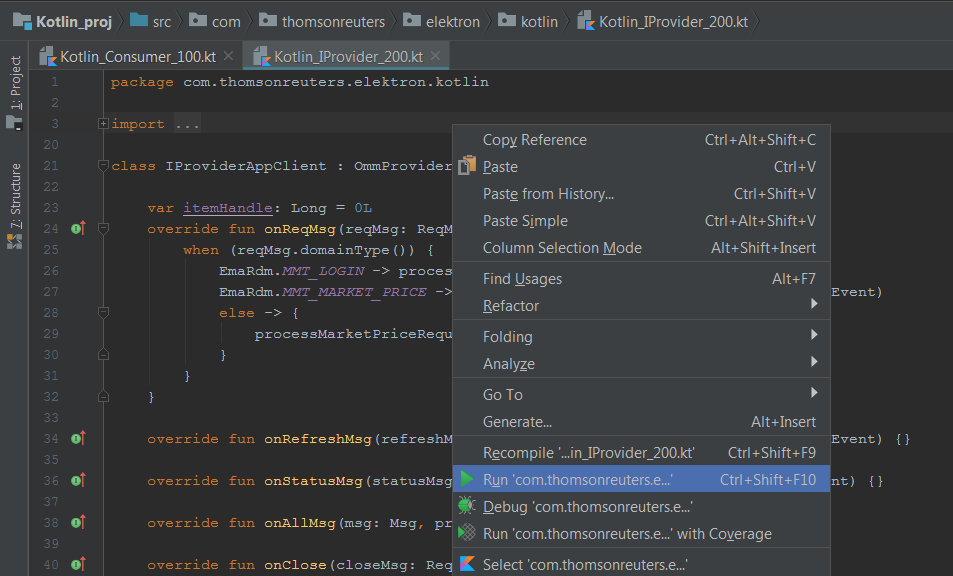
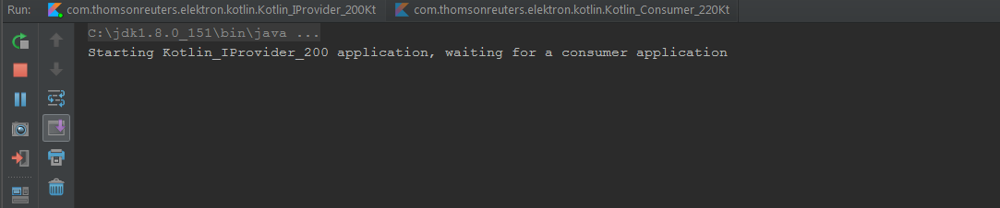
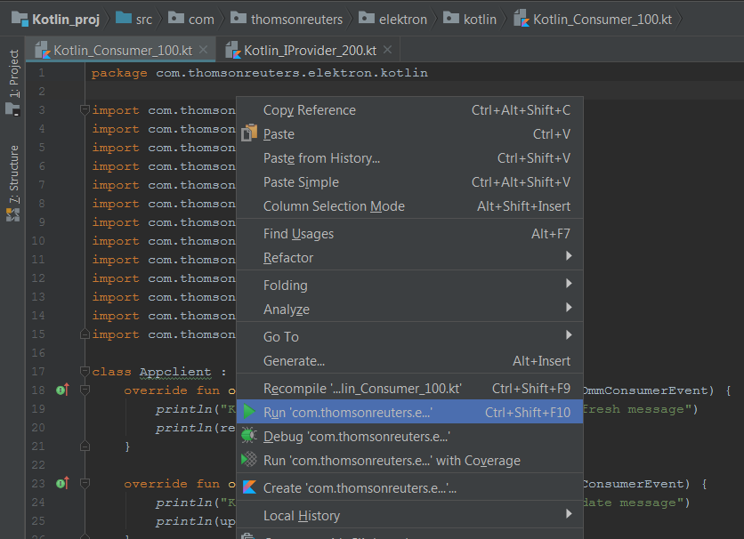
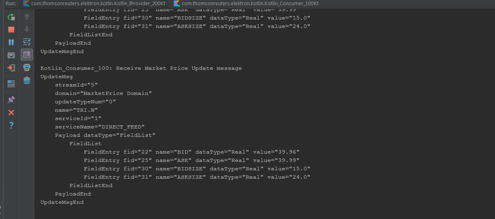

# Implement EMA Java Application with Kotlin Language

## Overview

This example project shows how to implement the [Elektron Message API Java (EMA Java)](https://developers.thomsonreuters.com/elektron/elektron-sdk-java) applications with Kotlin lanuage. The console applications source code are implemented in Kotlin programming language. All source code will be compiled to Java classes which compatible with Java virtual machine. The applications will run with these Java classes files. 

The example project contains one interactive-Provider application and two consumer applications. 
- The Kotlin_IProvider_200 shows how to implement a basic RSSL Interactive Provider application. 
- The Kotlin_Consumer_100 shows how to implement a basic RSSL Consumer application.
- The Kotlin_Consumer_220 shows how to implement an advance RSSL Consumer application. 

The consumer applications can consume data from Kotlin_IProvider_200 application or other Elektron data sources (ADS server, etc)


This example project and source code are compatible with [Kotlin](https://kotlinlang.org/) 1.2.50 and [Elektron SDK - Java edition](https://developers.thomsonreuters.com/elektron) 1.1.1 and 1.2.x versions.

## Kotlin Overview

[Kotlin](https://kotlinlang.org/) is a statically-typed programming language developed by [Jetbrains](https://www.jetbrains.com/) that runs on the Java virtual machine. Kotlin is interoperate with Java code and is reliant on Java code from the existing Java Class Library/Framework. Kotlin syntax aims for reducing Java language verbosity and complexity. Kotlin is a first-class programming language on Android OS. 

Although Kotlin source code can also be compiled to JavaScript and Native code, this example project focus only the JVM target environment.

## Prerequisite
This example requires the following dependencies software.
1. Java 8 SDK
2. [IntelliJ IDEA](https://www.jetbrains.com/idea/) Java IDE version 2017 and above. You can download Intelli IDEA Community Edition from this [page](https://www.jetbrains.com/idea/download/index.html). 
3. If you prefer to use Kotlin [command line compiler](https://github.com/JetBrains/kotlin/releases/latest), you can manual download and install it by follow the guide in [Kotlin - Working with the Command Line Compiler page](https://kotlinlang.org/docs/tutorials/command-line.html).
4. If you prefer to use Kotlin command line compiler, [Apache ANT](http://ant.apache.org/) version 1.8.2 and above is required.
4. [Elektron SDK Java Edition](https://developers.thomsonreuters.com/elektron/elektron-sdk-java). You can download the SDK package via this [link](https://developers.thomsonreuters.com/elektron/elektron-sdk-java/downloads) or via [GitHub](https://github.com/thomsonreuters/Elektron-SDK) page.

## Project Files Structure
- *src/* folder: Applications source code folder
- *Kotlin_Consumer_100.kt*: A basic consumer application source code 
- *Kotlin_Consumer_220.kt*: Consumer application source code that show how to handle incoming data
- *Kotlin_IProvider_200.kt*: Interactive Provider application source code
- *libs/* folder: Elektron SDK libraries files folder
- *etc/* folder: Eltrkon Data Dictionary files folder (RDMFieldDictionary and enumtype.def files)
- *EmaConfig.xml*: Elektron SDK Java Configuration file
- *.idea/* folder, *Kotlin_EMA.iml*: IntelliJ IDEA project file and folder
- *LICENSE.md*: License declaration file
- *README.md*: readme file
- *buid.xml*: ANT build and run file

## Buiild and run the Project with IntelliJ IDEA
1. Unzip or download the example project folder into a directory of your choice (example, D:/code/Kotlin_proj).
2. If you are using Elektron SDK Java 1.2.x (EMA Java 3.2.x), copy all required EMA Java 3.2.x API libraries to the "libs" folder. The required libraries are following
    - ema-3.2.x.x.jar (&lt;Elektron SDK Java 1.2 package&gt;/Java/Ema/Libs)
    - upa-3.2.x.x.jar (&lt;Elektron SDK Java package&gt;/Java/Eta/Libs)
    - upaValueAdd-3.2.x.x.jar (&lt;Elektron SDK Java package&gt;/Java/Eta/Libs)
    - commons-configuration-1.10.jar (&lt;Elektron SDK Java package&gt;/Elektron-SDK-BinaryPack/Java/Ema/Libs/apache)
    - commons-lang-2.6.jar (&lt;Elektron SDK Java package&gt;/Elektron-SDK-BinaryPack/Java/Ema/Libs/apache)
    - commons-logging-1.2.jar (&lt;Elektron SDK Java package&gt;/Elektron-SDK-BinaryPack/Java/Ema/Libs/apache)
    - commons-collections-3.2.2.jar (&lt;Elektron SDK Java package&gt;/Elektron-SDK-BinaryPack/Java/Ema/Libs/apache)
    - slf4j-api-1.7.12.jar (&lt;Elektron SDK Java package&gt;/Elektron-SDK-BinaryPack/Java/Ema/Libs/SLF4J/slf4j-1.7.12)
    - slf4j-jdk14-1.7.12.jar (&lt;Elektron SDK Java package&gt;/Elektron-SDK-BinaryPack/Java/Ema/Libs/SLF4J/slf4j-1.7.12)
3. If you are using Elektron SDK Java 1.1.1 (EMA Java 3.1.1), copy all required EMA Java 3.1.1 API libraries to the "libs" folder. The required libraries are following
    - ema.jar (&lt;Elektron SDK Java package&gt;/Ema/Libs)
    - upa.jar (&lt;Elektron SDK Java package&gt;/Eta/Libs)
    - upaValueAdd.jar (&lt;Elektron SDK Java package&gt;/Eta/Libs)
    - commons-configuration-1.10.jar (&lt;Elektron SDK Java package&gt;/Ema/Libs/apache)
    - commons-lang-2.6.jar (&lt;Elektron SDK Java package&gt;/Ema/Libs/apache)
    - commons-logging-1.2.jar (&lt;Elektron SDK Java package&gt;/Ema/Libs/apache)
    - org.apache.commons.collections.jar (&lt;Elektron SDK Java package&gt;/Ema/Libs/apache)
    - slf4j-api-1.7.12.jar (&lt;Elektron SDK Java package&gt;/Ema/Libs/SLF4J/slf4j-1.7.12)
    - slf4j-jdk14-1.7.12.jar (&lt;Elektron SDK Java package&gt;/Ema/Libs/SLF4J/slf4j-1.7.12)
4. Open IntelliJ IDEA Java IDE, select **Create New Project**.

    

5. Select **Kotlin/JVM** in the Addition Libraries and Frameworks window, then click Next button.

    

6. Set **Project location** folder to the directory from step *1* .

    

7. The example project and sub folders will be available in IntelliJ IDEA Java IDE.

    

8. Right click on *libs* folder, then choose **Addd as Library...**, then click Ok button to add EMA Java libraries to the project.

    

9. Click on the **Build** menu bar, then choose **Build Project** to build the project (You may choose **Rebuild Project** if you change any source code).

    

10. Open Kotlin_IProvider_200.kt file, right click and choose **Run** to start the Kotlin_IProvider_200 provider application.

    

11. The Kotlin_IProvider_200 application will be started and waiting for a consumer application.

    

12. Open Kotlin_Consumer_100.kt file, right click and choose **Run** to start the Kotlin_Consumer_100 consumer application.

    

13. The Kotlin_Consumer_100 application will be started, then connects and consumes data from Kotlin_IProvider_200 application.

    

## Buiild and run the Project with ANT
1. Unzip or download the example project folder into a directory of your choice (example, D:/code/Kotlin_proj).
2. Download and install Kotlin command line compiler by follow the guide in [Kotlin - Working with the Command Line Compiler page](https://kotlinlang.org/docs/tutorials/command-line.html) into a directory of your choice (example, D:/Project/Compilers/kotlinc)
2. If you are using Elektron SDK Java 1.2.x (EMA Java 3.2.x), copy all required EMA Java 3.2.x API libraries to the "libs" folder. The required libraries are following
    - ema-3.2.x.x.jar (&lt;Elektron SDK Java 1.2 package&gt;/Java/Ema/Libs)
    - upa-3.2.x.x.jar (&lt;Elektron SDK Java package&gt;/Java/Eta/Libs)
    - upaValueAdd-3.2.x.x.jar (&lt;Elektron SDK Java package&gt;/Java/Eta/Libs)
    - commons-configuration-1.10.jar (&lt;Elektron SDK Java package&gt;/Elektron-SDK-BinaryPack/Java/Ema/Libs/apache)
    - commons-lang-2.6.jar (&lt;Elektron SDK Java package&gt;/Elektron-SDK-BinaryPack/Java/Ema/Libs/apache)
    - commons-logging-1.2.jar (&lt;Elektron SDK Java package&gt;/Elektron-SDK-BinaryPack/Java/Ema/Libs/apache)
    - commons-collections-3.2.2.jar (&lt;Elektron SDK Java package&gt;/Elektron-SDK-BinaryPack/Java/Ema/Libs/apache)
    - slf4j-api-1.7.12.jar (&lt;Elektron SDK Java package&gt;/Elektron-SDK-BinaryPack/Java/Ema/Libs/SLF4J/slf4j-1.7.12)
    - slf4j-jdk14-1.7.12.jar (&lt;Elektron SDK Java package&gt;/Elektron-SDK-BinaryPack/Java/Ema/Libs/SLF4J/slf4j-1.7.12)
3. If you are using Elektron SDK Java 1.1.1 (EMA Java 3.1.1), copy all required EMA Java 3.1.1 API libraries to the "libs" folder. The required libraries are following
    - ema.jar (&lt;Elektron SDK Java package&gt;/Ema/Libs)
    - upa.jar (&lt;Elektron SDK Java package&gt;/Eta/Libs)
    - upaValueAdd.jar (&lt;Elektron SDK Java package&gt;/Eta/Libs)
    - commons-configuration-1.10.jar (&lt;Elektron SDK Java package&gt;/Ema/Libs/apache)
    - commons-lang-2.6.jar (&lt;Elektron SDK Java package&gt;/Ema/Libs/apache)
    - commons-logging-1.2.jar (&lt;Elektron SDK Java package&gt;/Ema/Libs/apache)
    - org.apache.commons.collections.jar (&lt;Elektron SDK Java package&gt;/Ema/Libs/apache)
    - slf4j-api-1.7.12.jar (&lt;Elektron SDK Java package&gt;/Ema/Libs/SLF4J/slf4j-1.7.12)
    - slf4j-jdk14-1.7.12.jar (&lt;Elektron SDK Java package&gt;/Ema/Libs/SLF4J/slf4j-1.7.12)
4. Copy Kotlin runtime library file to the "libs" folder. 
    - *kotlin-runtime.jar (For build and run with ANT only, &lt;Kotlin compiler install location&gt;/lib)*
5. Install and configure [Apache ANT](http://ant.apache.org/) in your machine
6. Edit the **kotlin.dir** line in *build.xml* file to be your Kotlin compiler install location (example, D:/Project/Compilers/kotlinc)
    ```
    <property name="kotlin.dir" value="{your Kotlin compiler folder}"/>
    ```
7. Open project folder (example, D:/code/Kotlin_proj), then open command line and run ```ant build``` command. All application class files will be available at *out* folder, the EmaConfig.xml and etc/ dictionary folder also copied to the out folder automatically.
    ```
    $>ant build  
    ```
8. Inside project folder, open command line and run the Kotlin_IProvider_200 application with the following ant command
    ```
    $> ant run run_Kotlin_IProvider_200Kt
    ```
9. Inside project folder, open command line and run run the Kotlin_IProvider_100 application with the following ant command
    ```
    $> ant run_Kotlin_Consumer_100Kt
    ```
10. Example Kotlin_IProvider_200 application output
    ```
    Starting Kotlin_IProvider_200 application, waiting for a consumer application
    Mar 14, 2018 6:03:58 PM com.thomsonreuters.ema.access.ServerChannelHandler react
    orChannelEventCallback
    INFO: loggerMsg
       ClientName: ServerChannelHandler
       Severity: Info
        Text:    Received ChannelUp event on ClientHandle 1
           Instance Name Provider_1_1
           Component Version etaj3.1.1.E1.all.rrg|emaj3.1.0.E1.all.rrg
    loggerMsgEnd


    Receive Login Request message from rdc, send Login Refresh
    Kotlin_IProvider_200: Receive Market Price Request message
    Kotlin_IProvider_200: Send  Market Price Refresh message
    Kotlin_IProvider_200: Send  Market Price Update messages
    Kotlin_IProvider_200: Send  Market Price Update messages
    ```
11. Example Kotlin_Consumer_100 application output
    ```
	Starting Kotlin_Consumer_100 application
	Mar 14, 2018 6:03:57 PM com.thomsonreuters.ema.access.ChannelCallbackClient reac
	torChannelEventCallback
	INFO: loggerMsg
		ClientName: ChannelCallbackClient
		Severity: Info
		Text:    Received ChannelUp event on channel Channel_1
			Instance Name Consumer_1_1
			Component Version etaj3.1.1.E1.all.rrg|emaj3.1.0.E1.all.rrg
	loggerMsgEnd


	Kotlin_Consumer_100: Send item request message
	Kotlin_Consumer_100: Receive Market Price Refresh message
	RefreshMsg
		streamId="5"
		domain="MarketPrice Domain"
		solicited
		RefreshComplete
		state="Open / Ok / None / 'Refresh Completed'"
		itemGroup="00 00"
		name="TRI.N"
		serviceId="1"
		serviceName="DIRECT_FEED"
		Payload dataType="FieldList"
			FieldList
				FieldEntry fid="3" name="DSPLY_NAME" dataType="Rmtes" value="TRI.N"
				FieldEntry fid="15" name="CURRENCY" dataType="Enum" value="840"
				FieldEntry fid="21" name="HST_CLOSE" dataType="Real" value="39.0"
				FieldEntry fid="22" name="BID" dataType="Real" value="39.9"
				FieldEntry fid="25" name="ASK" dataType="Real" value="39.94"
				FieldEntry fid="30" name="BIDSIZE" dataType="Real" value="9.0"
				FieldEntry fid="31" name="ASKSIZE" dataType="Real" value="19.0"
			FieldListEnd
		PayloadEnd
	RefreshMsgEnd

	Kotlin_Consumer_100: Receive Market Price Update message
	UpdateMsg
		streamId="5"
		domain="MarketPrice Domain"
		updateTypeNum="0"
		name="TRI.N"
		serviceId="1"
		serviceName="DIRECT_FEED"
		Payload dataType="FieldList"
			FieldList
				FieldEntry fid="22" name="BID" dataType="Real" value="39.92"
				FieldEntry fid="25" name="ASK" dataType="Real" value="39.95"
				FieldEntry fid="30" name="BIDSIZE" dataType="Real" value="11.0"
				FieldEntry fid="31" name="ASKSIZE" dataType="Real" value="20.0"
			FieldListEnd
		PayloadEnd
	UpdateMsgEnd
	```
12. You can also run Kotlin_Consumer_220 application via the following ant command
    ```
    $> ant run_Kotlin_Consumer_220Kt
    ```


## References
For further details, please check out the following resources:
* [Elektron SDK Family site](https://developers.thomsonreuters.com/elektron)
* [Elektron Java API page](https://developers.thomsonreuters.com/elektron/elektron-sdk-java/) on the [Thomson Reuters Developer Community](https://developers.thomsonreuters.com/) web site.
* Developer Webinar: [Introduction to Enterprise App Creation With Open-Source Elektron Message API](https://www.youtube.com/watch?v=2pyhYmgHxlU)
* Elektron Message API Java: [Quick Start](https://developers.thomsonreuters.com/elektron/elektron-sdk-java/quick-start)
* Developer Article: [10 important things you need to know before you write an Elektron Real Time application](https://developers.thomsonreuters.com/article/10-important-things-you-need-know-you-write-elektron-real-time-application)
* [Kotlin programming language](https://kotlinlang.org/)
* Kotlin: [Using Ant](https://kotlinlang.org/docs/reference/using-ant.html)

For any question related to this article or Elektron WebSocket API page, please use the Developer Community [Q&A Forum](https://community.developers.thomsonreuters.com/).

