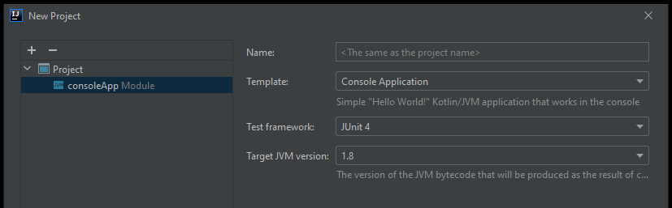
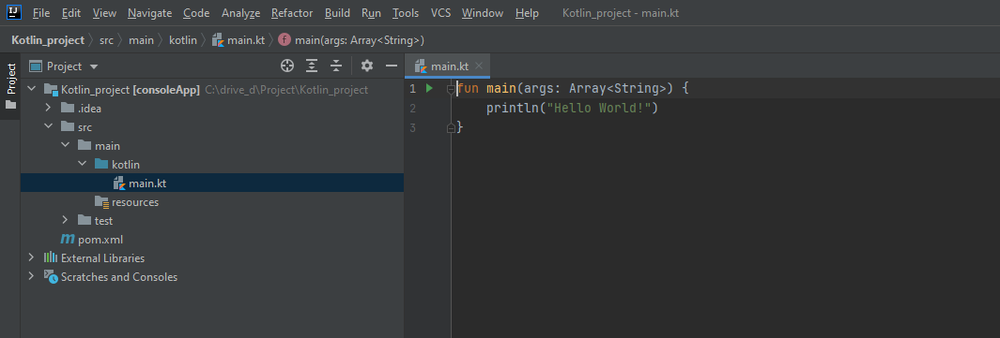
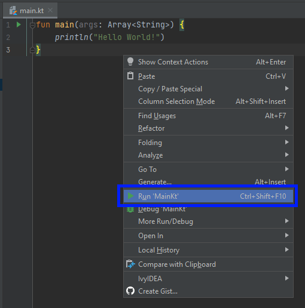
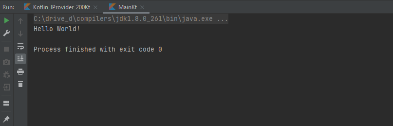
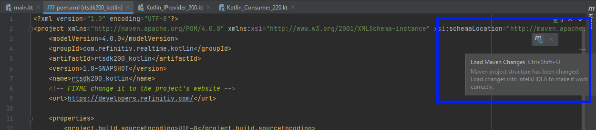
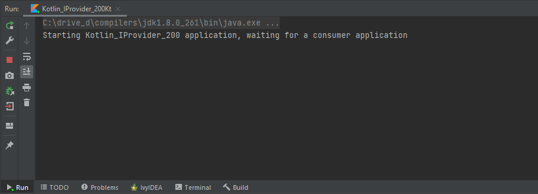
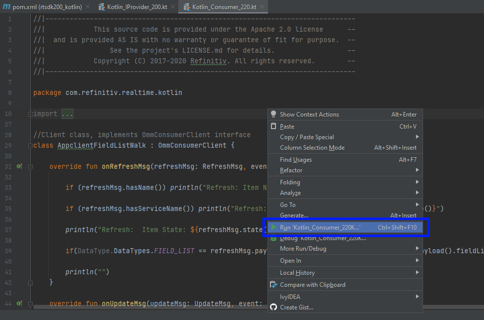
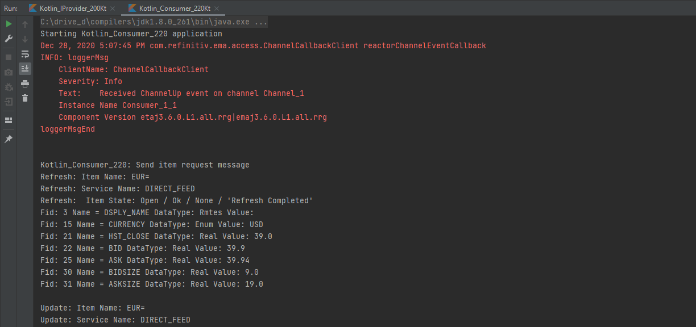
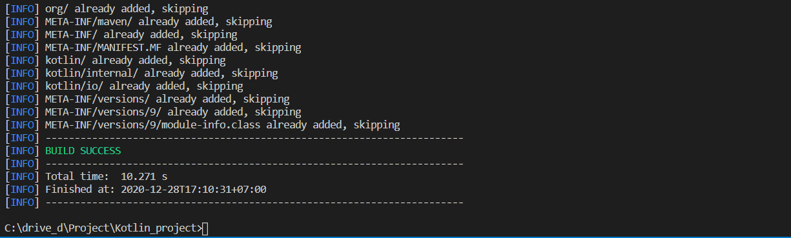

# Implement EMA Java Application with Kotlin Language

## Overview

This example project shows how to implement the [Enterprise Message API Java (EMA Java)](https://developers.refinitiv.com/elektron/elektron-sdk-java) (formerly known as Elektron Message API) OMM Consumer and OMM Provider applications with Kotlin language. The application source codes are implemented in Kotlin language with EMA Java library. All source code will be compiled to Java Virtual Machine (JVM) compatible Java classes and run in a console.   

The example project contains one Interactive-Provider application and two Consumer applications. 
- The Kotlin_IProvider_200 shows how to implement a basic RSSL Interactive Provider application. 
- The Kotlin_Consumer_100 shows how to implement a basic RSSL Consumer application.
- The Kotlin_Consumer_220 shows how to implement a RSSL Consumer application that handles incoming data for each FID type.

The consumer applications can consume data from Kotlin_IProvider_200 application or other Refinitiv Real-Time data sources (Refinitiv Real-Time Advanced Distribution Server, [Refinitiv Real-Time Test Data](https://developers.refinitiv.com/pages/elektron-test-data-1), etc).


You can find more detail regarding the OMM Consumer and OMM Interactive Provider interaction in EMA Java RDM Usage Guide sections *2.4 OMM Consumer / OMM Interactive Provider Initial Interaction* and *2.5 Sending and Receiving Content*. The EMA Java RDM Usage Guide is available in [Refinitiv Real-Time SDK - Java: Documentation page](https://developers.refinitiv.com/en/api-catalog/elektron/elektron-sdk-java/documentation).

This example project and source code are compatible with [Kotlin](https://kotlinlang.org/) version 1.4.21, [IntelliJ IDEA](https://www.jetbrains.com/idea/) Java IDE versions 2020.3 and [Refinitiv Real-Time SDK - Java edition](https://developers.refinitiv.com/en/api-catalog/elektron/elektron-sdk-java) 2.0.0 L1 (EMA Java 3.6.0 - Maven Central dependency: ```com.refinitiv.ema:ema:3.6.0.0```) .

The example project has been implemented and tested on [Kotlin-Maven build tool](https://kotlinlang.org/docs/reference/using-maven.html).

## IMPORTANT Rebranding Announcement: 

Starting with version RTSDK 2.0.0.L1 (same as EMA/ETA 3.6.0.L1), there are namespace changes and library name changes. Please note that all interfaces remain the same as prior releases of RTSDK and Elektron SDK and will remain fully wire compatible. Along with RTSDK 2.X version, a [REBRAND.md](https://github.com/Refinitiv/Real-Time-SDK/blob/master/REBRAND.md) is published to detail impact to existing applications and how to quickly adapt to the re-branded libraries. Existing applications will continue to work indefinitely as-is.  Applications should be proactively rebranded to be able to utilize new features, security updates or fixes post 2.X release. Please see [PCN](https://my.refinitiv.com/content/mytr/en/pcnpage/12072.html?_ga=2.103280071.632863608.1606731450-325683966.1598503157) for more details on support. 

## Kotlin Overview

[Kotlin](https://kotlinlang.org/) is a statically-typed programming language developed by [Jetbrains](https://www.jetbrains.com/) that runs on the Java virtual machine. Kotlin is a first-class programming language on Android OS. Kotlin interpolates with Java code and is reliant on Java code from the existing Java Class Library/Framework. Kotlin syntax aims for reducing Java language verbosity and complexity. The language is also designed with Java Interoperability in mind. Existing Java code (and EMA Java libraries) can be naturally called from Kotlin. 

Although Kotlin source code can also be compiled to JavaScript and Native code, this example project focus only on the JVM target environment.

## Prerequisite
This example requires the following dependencies software.
1. Oracle Java 8 SDK.
2. [IntelliJ IDEA](https://www.jetbrains.com/idea/) Java IDE version 2020.3 and above. You can download IntelliJ IDEA Community Edition from this [page](https://www.jetbrains.com/idea/download/index.html). 
3. [Refinitiv Real-Time SDK (RTSDK) Java Libraries](https://mvnrepository.com/artifact/com.refinitiv.ema/ema) via [Maven Central website](https://search.maven.org/search?q=g:com.refinitiv.ema). You can also download the SDK documents and examples from [Refinitiv Real-Time SDK - Java: Download page](https://developers.refinitiv.com/en/api-catalog/elektron/elektron-sdk-java/download) or [GitHub](https://github.com/Refinitiv/Real-Time-SDK) page.
4. [Apache Maven](https://maven.apache.org/) project management and comprehension tool.
5. Internet connection.

## Project Files Structure
- *src/main/kotlin* folder: Applications source code folder
- *Kotlin_Consumer_100.kt*: A basic consumer application source code 
- *Kotlin_Consumer_220.kt*: Consumer application source code that show how to handle incoming data
- *Kotlin_IProvider_200.kt*: Interactive Provider application source code
- *pom.xml* : Kotlin-RTSDK Maven's pom.xml file.
- *etc/* folder: RTSDK Dictionary files folder (RDMFieldDictionary and enumtype.def files)
- *EmaConfig.xml*: RTSDK Java Configuration file
- *LICENSE.md*: License declaration file
- *README.md*: readme file

## Build and run the Project with IntelliJ IDEA
1. Create a development directory of your choice (for example, C:\drive_d\Project\Kotlin_project).
2. Open IntelliJ IDEA Java IDE, select **Create New Project**.

    

3. Select **Kotlin**, Project Templates: **JVM Console Application**, Build System: **Maven**, and Project JDK. Finally, input your project folder location and project name

    

4. Leave everything as is and click the Finish button.

    

5. IntelliJ IDEA Java IDE automatically generates project Maven's pom.xml file, an example *main.kt* console application file in *src/main/kotlin* of the project folder.

    

6. The main.kt file is useful for verifying IntelliJ and Kotlin SDK/Runtime setup in the developers' environment. You can right-click on the main.kt file, then choose **Run 'MainKt'** menu to test running a console Kotlin application.

    

7. The result of main.kt file console application is the following:

    

8. Next, Unzip or download the example project folder and copy **src**, **etc** folders, **EmaConfig.xml** file, and **pom.xml** file (replacing existing pom.xml one that generated by the IDE) to the development directory (example, C:\drive_d\Project\Kotlin_project). The EMA-Kotiln example applications, etc folder, and EmaConfig.xml file will be available in IntelliJ IDEA.

    

9. You may need to open a newly replaced pom.xml file, and click the **reload** button to reload all Kotlin and RTSDK dependencies.

    

10. Click on the **Build** menu bar, then choose **Build Project** to build the project (You may choose **Rebuild Project** if you change any source code).
    

    

11. Open Kotlin_IProvider_200.kt file, right-click and choose **Run** to start the Kotlin_IProvider_200 provider application.

    

12. The Kotlin_IProvider_200 application will be started and waiting for a consumer application.

    

13. Open Kotlin_Consumer_220.kt file, right-click and choose **Run** to start the Kotlin_Consumer_220 consumer application.

    

14. The Kotlin_Consumer_220 application will be started, then connects and consumes data from Kotlin_IProvider_200 application.
    


## Build and run the Project with Apache Maven via a command line

1. Create a development directory of your choice (for example, C:\drive_d\Project\Kotlin_project).
2. Unzip or download the example project folder to a development directory.
3. Open a console or command prompt to your development directory.
4. Run ```$>mvn package``` command in a console to build the demo applications into a single-all-dependencies *rtsdk200_kotlin-1.0-SNAPSHOT-jar-with-dependencies.jar* file in the project's *target* folder.

     

     
5. Then you can run Kotlin_IProvider_200 application demo application with the following command:

    *Windows Command Prompt*
    ```
    $>java -cp .;target/rtsdk200_kotlin-1.0-SNAPSHOT-jar-with-dependencies.jar com.refinitiv.realtime.kotlin.Kotlin_IProvider_200Kt
    ```

6. To run Kotlin_Consumer_220.kt demo application, open another console for ema_example folder and run the following command:

    *Windows Command Prompt*
    ```
    java -cp .;target/rtsdk200_kotlin-1.0-SNAPSHOT-jar-with-dependencies.jar com.refinitiv.realtime.kotlin.Kotlin_Consumer_220Kt
    ```

## Conclusion

Kotlin is now a rising star cross-platform, statically typed, general-purpose programming language. The language lets developers implement a concise and expressive code while maintaining full compatibility with Java. 

This language simplicity helps developers write the Real-Time application using EMA/RTSDK in a simple way that simpler and smaller than implement EMA application on the native-Java.

## References
For further details, please check out the following resources:
* [Refinitiv Real-Time SDK Java page](https://developers.refinitiv.com/en/api-catalog/elektron/elektron-sdk-java) on the [Refinitiv Developer Community](https://developers.refinitiv.com/) web site.
* [Refinitiv Real-Time SDK Family](https://developers.refinitiv.com/en/use-cases-catalog/refinitiv-real-time) page.
* [Kotlin programming language: Reference](https://kotlinlang.org/docs/reference/) page.
* [Kotlin programming language: Tutorials](https://kotlinlang.org/docs/tutorials/) page.
* [Enterprise Message API Java Quick Start](https://developers.refinitiv.com/en/api-catalog/elektron/elektron-sdk-java/quick-start)
* [Developer Webinar: Introduction to Enterprise App Creation With Open-Source Enterprise Message API](https://www.youtube.com/watch?v=2pyhYmgHxlU)
* [Developer Article: 10 important things you need to know before you write an Enterprise Real Time application](https://developers.refinitiv.com/article/10-important-things-you-need-know-you-write-elektron-real-time-application)

For any question related to this article or Enterprise Message API page, please use the Developer Community [Q&A Forum](https://community.developers.refinitiv.com/).
